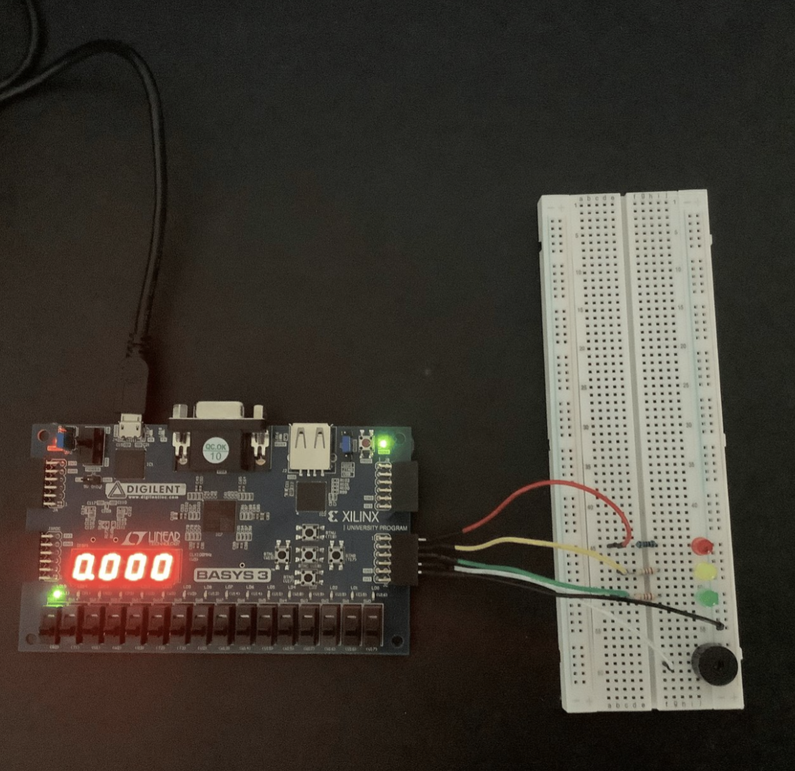
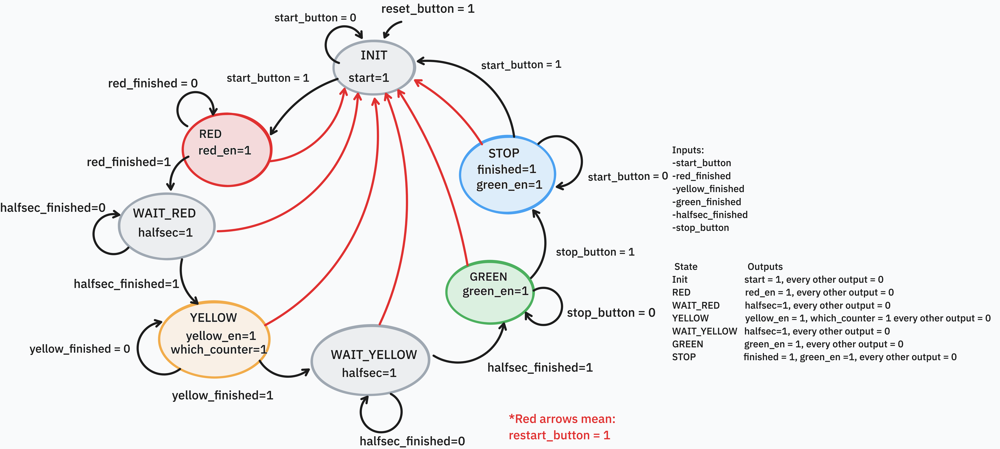

# FPGA Reaction Training System

<p align="center">
  
</p>

<p align="center">
  <strong>A hardware-based reaction time training system implemented in Verilog HDL on an FPGA.</strong>
</p>

<p align="center">
This project demonstrates the implementation of a complete digital system capable of measuring a user's reaction time through a randomized traffic-light sequence. The design combines finite state machines, pseudo-random number generation, timers, multiplexed displays, PWM, and hardware debouncing into a modular FPGA application.
</p>

---

# Demo

🎥 **Watch the project demonstration:**

https://youtu.be/demo-reaction-training-system

> **Note:** The demonstration video is in **Spanish**.

---

# Overview

The **FPGA Reaction Training System** is a digital hardware project developed entirely in **Verilog HDL**. The objective is to measure a user's reaction time by presenting a randomized traffic-light sequence that prevents the user from anticipating when to react.

Unlike software-based implementations, every subsystem executes directly in FPGA hardware, making the design deterministic while reinforcing core digital design principles such as sequential logic, finite state machines, timing, and modular RTL development.

---

# Features

- Verilog HDL implementation
- Fully synthesizable RTL design
- Modular architecture
- Finite State Machine (FSM)
- Randomized wait time using a 3-bit LFSR
- Reaction time measurement
- Multiplexed four-digit seven-segment display
- Traffic-light LED sequence
- PWM-controlled passive buzzer
- Hardware button debouncing
- Vivado compatible

---

# Hardware Components

- FPGA Development Board
- Breadboard
- Red LED
- Yellow LED
- Green LED
- Passive Buzzer
- Pushbuttons
- Seven-Segment Display
- Jumper Wires

---

# System Inputs

| Input | Description |
|--------|-------------|
| Start Button | Starts a new reaction test |
| Reaction Button | Stops the reaction timer |
| Reset | Resets the system |
| FPGA Clock | Main system clock |

---

# System Outputs

| Output | Description |
|--------|-------------|
| Red LED | Initial state |
| Yellow LED | Random waiting period |
| Green LED | User reaction signal |
| Seven-Segment Display | Displays the measured reaction time |
| Passive Buzzer | Audio feedback |

---

# System Operation

The reaction test follows the sequence below:

1. The user presses the **Start** button.
2. The **Red LED** turns on.
3. The **Yellow LED** remains active for a randomized amount of time.
4. A **3-bit Linear Feedback Shift Register (LFSR)** generates the random waiting period.
5. The **Green LED** turns on.
6. The reaction timer immediately starts.
7. The user presses the **Reaction** button.
8. The elapsed reaction time is captured.
9. The measured value is displayed on the seven-segment display.
10. The user can immediately begin another attempt.

---

# Finite State Machine

The system behavior is controlled through a Finite State Machine responsible for coordinating the traffic-light sequence, random delay generation, reaction timer, display updates, and restart logic.

<p align="center">

</p>

---

# RTL Schematic

The following RTL schematic was generated automatically by **Xilinx Vivado** after synthesis and illustrates the hardware architecture and module interconnections of the complete design.

📄 **RTL Schematic**

[View RTL Schematic](./images/schematic.pdf)

---

# Repository Structure

```text
FPGA-Reaction-Training-System
│
├── images
│   ├── reaction_training_systemimg.png
│   ├── fsm.png
│   └── schematic.pdf
│
├── top.v
├── lights_3.v
├── traffic_timers.v
├── display_system.v
├── randomGenerator.v
├── THREE_BIT_COUNTER.v
├── THREE_BIT_LFSR.v
├── TOP_LFSR_COUNTER.v
├── buzzer.v
├── debouncing.v
├── constraints.xdc
│
└── README.md
```

---

# Verilog Modules

## `top.v`

Top-level module that integrates every subsystem of the project, including the finite state machine, timers, display controller, random generator, buzzer, and input/output interfaces.

---

## `lights_3.v`

Controls the traffic-light sequence by driving the Red, Yellow, and Green LEDs according to the current system state.

---

## `traffic_timers.v`

Implements all timing requirements for the reaction test, including LED durations and reaction time measurement.

---

## `display_system.v`

Drives the multiplexed four-digit seven-segment display and presents the measured reaction time.

---

## `randomGenerator.v`

Generates the randomized delay before enabling the Green LED.

---

## `THREE_BIT_LFSR.v`

Implements a 3-bit Linear Feedback Shift Register used for pseudo-random number generation.

---

## `THREE_BIT_COUNTER.v`

Counter module used together with the LFSR to create randomized waiting intervals.

---

## `TOP_LFSR_COUNTER.v`

Combines the counter and LFSR into the complete random timing subsystem.

---

## `buzzer.v`

Generates a PWM signal that drives the passive buzzer.

---

## `debouncing.v`

Filters mechanical switch bounce from the user buttons to ensure reliable input detection.

---

## `constraints.xdc`

Contains the FPGA pin assignments required for synthesis and implementation.

---

# Digital Design Concepts

This project demonstrates practical implementation of:

- Verilog HDL
- RTL Design
- Finite State Machines
- Sequential Logic
- Combinational Logic
- Hardware Timers
- Clock Division
- PWM Generation
- Seven-Segment Display Multiplexing
- Linear Feedback Shift Registers (LFSR)
- Hardware Debouncing
- FPGA Synthesis

---

# Building the Project

1. Open **Xilinx Vivado**.
2. Create a new RTL Project.
3. Add all Verilog source files.
4. Import the **constraints.xdc** file.
5. Set **top.v** as the Top Module.
6. Run **Synthesis**.
7. Run **Implementation**.
8. Generate the Bitstream.
9. Program the FPGA development board.
10. Press the **Start** button to begin the reaction training sequence.

---

# Project Gallery

## Hardware Prototype

<p align="center">

</p>

---

## Finite State Machine

<p align="center">

</p>

---

## RTL Schematic

📄 **[Open RTL Schematic](./images/schematic.pdf)**

---

# Contributors

- **Hiram R. Rodríguez Hernández**
- **Janzel Silva**
- **Kevin Colón**
- **Sergio A. Da Silva López**
- **Nollan Rivera**

---

# Acknowledgments

This project was developed as part of a Digital Design course. It provided hands-on experience in FPGA development, hardware description languages, finite state machines, and digital system integration.

---

# Video Credit

The demonstration video was recorded and edited by **Sergio A. Da Silva López**.

---

# License

This project is intended for educational purposes.
